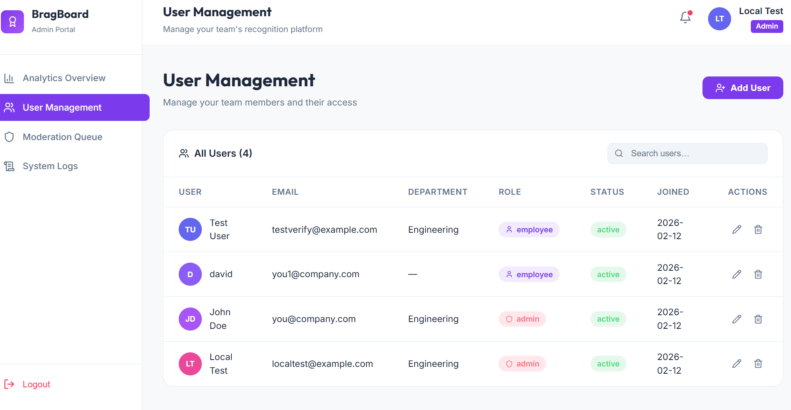

# BragBoard

BragBoard is a premium recognition platform designed to celebrate team achievements and foster a culture of appreciation.



## Core Features

### 🚀 User Management
The robust Admin Portal provides a centralized interface for managing the entire team. Features include:
- **User Insights**: A comprehensive list of all team members with their roles, departments, and active status.
- **Dynamic Search**: Instantly filter through team members by name, email, or department.
- **Role Control**: Securely manage permissions by assigning 'Admin' or 'Employee' roles.
- **CRUD Operations**: Effortlessly add new team members, edit existing profiles, or remove users when necessary.
- **Modern UI**: A clean, light-themed interface with vibrant purple accents and intuitive navigation.

## Tech Stack

### Frontend
- **React**: Modern component-based architecture.
- **Vite**: Ultra-fast development environment and bundling.
- **Lucide React**: Stunning, consistent iconography.
- **Tailwind CSS**: Utility-first styling for a premium look.

### Backend
- **FastAPI**: High-performance Python framework.
- **SQLAlchemy**: Robust ORM for database interactions.
- **PostgreSQL**: Reliable relational database.
- **Bcrypt**: State-of-the-art password security.

## Getting Started

### Prerequisites
- Python 3.10+
- Node.js 18+
- Docker (for database)

### Installation

1. **Clone the repository**
   ```bash
   git clone <repository-url>
   cd bragboard-jan-26
   ```

2. **Start the Database**
   ```bash
   docker-compose up -d db
   ```

3. **Backend Setup**
   ```bash
   cd server
   python -m venv venv
   source venv/bin/activate  # On Windows: venv\Scripts\activate
   pip install -r requirements.txt
   uvicorn main:app --reload
   ```

4. **Frontend Setup**
   ```bash
   cd client
   npm install
   npm run dev
   ```

## License
MIT License.